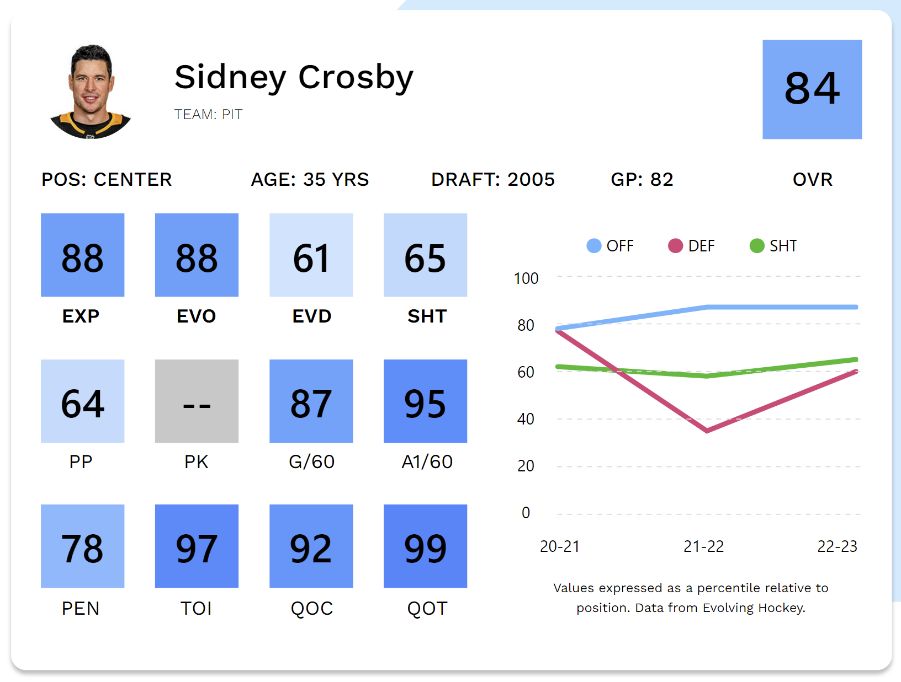

# Offside

Offside presents NHL player cards built with [Evolving Hockey's](https://evolving-hockey.com/) Goals Above Replacement (GAR) Model. With data since the 2007-08 season, the player cards can be adjusted to any season from 07-08 to present.

Built with the MERN stack: MongoDB, Express, React, and Node.

## The Data

The values displayed are percentile rankings of the player's stats.

- **OVR**: Total GAR
- **EXP**: Total Expected GAR
- **EVO**: Expected Even Strength Offensive GAR (How well a player drives offence)
- **EVD**: Expected Even Strength Defensive GAR (How well a player prevents scoring chances)
- **SHT**: Shooting Talent Relative to Average
- **PP**: Expected Powerplay GAR
- **PK**: Expected Shorthanded GAR
- **G/60**: Goals per 60 minutes of ice time
- **A1/60**: Primary Assists per 60 minutes of ice time
- **PEN**: Penalties Taken/Drawn GAR
- **QOC**: Quality of Competition (By ice-time)
- **QOT**: Quality of Teammates (By ice-time)

Graph:

- **OFF**: Total Offensive GAR (EVO + PP)
- **DEF**: Total Defensive GAR (EVD + PK)
- **SHT**: Shooting Talent Relative to Average